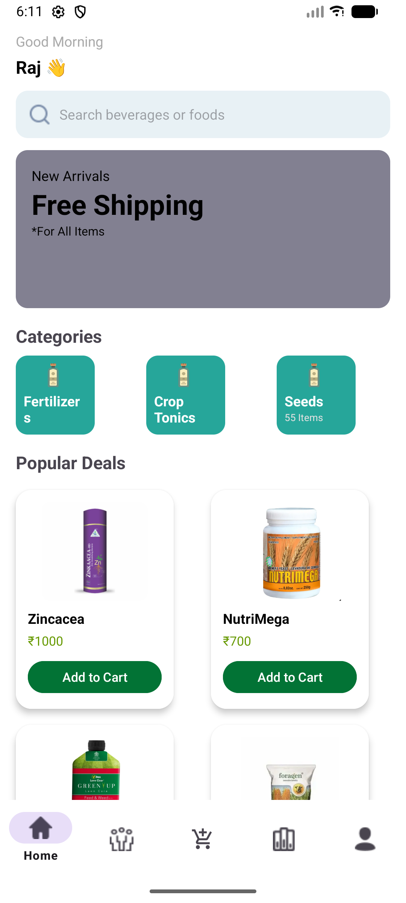
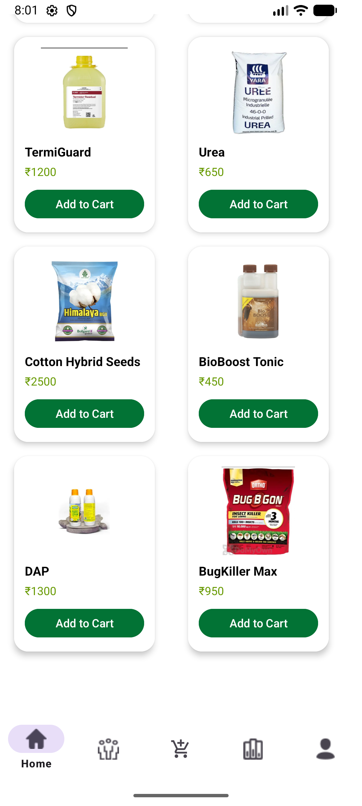
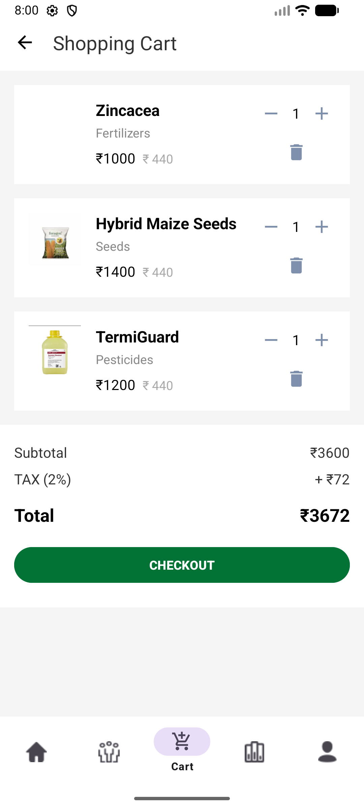
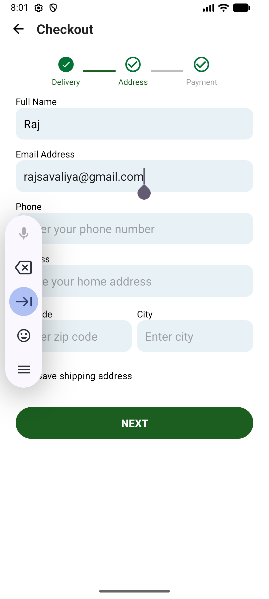

# 🌿 AgriMed Store – Smart Agriculture E-Commerce Android App


---

## 📌 Project Overview

**AgriMed Store** is an Android-based e-commerce and product comparison application designed specifically for agricultural needs. The app allows farmers, retailers, and users to explore, compare, and purchase agricultural medicines and products efficiently.

The main goal of this project is to simplify decision-making for users by providing **price comparison, detailed product insights, and an intuitive interface**.

---

## 🎯 Objectives

* Provide a centralized platform for agricultural products
* Enable smart comparison between different products
* Help users choose cost-effective and suitable medicines
* Improve accessibility of agricultural solutions

---

## ✨ Key Features

### 🔍 Product Browsing

* View a wide range of agricultural medicines
* Categorized product listing for easy navigation

### ⚖️ Product Comparison

* Compare multiple products side-by-side
* Analyze price, features, and specifications

### 💰 Price Comparison

* Identify the best deal available
* Helps users save money

### 📄 Detailed Product Information

* Usage instructions
* Benefits and composition
* Pricing and availability

### 🛒 Cart System (if implemented)

* Add products to cart
* Simple purchase flow

### 👤 User-Friendly Interface

* Clean UI/UX
* Easy navigation
* Responsive design

---

## 🏗️ System Architecture

The application follows a modular architecture:

* **Frontend:** Android (Java/Kotlin)
* **Backend:** (PHP / Firebase / REST API)
* **Database:** (MySQL / Firebase Realtime DB / Firestore)

---

## 🛠️ Tech Stack

| Technology      | Purpose          |
| --------------- | ---------------- |
| Java / Kotlin   | App development  |
| Android Studio  | IDE              |
| XML             | UI Design        |
| Firebase / API  | Backend services |
| MySQL (if used) | Data storage     |
| Git & GitHub    | Version control  |

---

## 📂 Project Structure

```
AgriMed-Store/
│
├── app/
│   ├── src/
│   ├── res/
│   ├── java/
│   └── AndroidManifest.xml
│
├── gradle/
├── build.gradle.kts
├── settings.gradle.kts
└── ...
```

---

## 🚀 Installation & Setup

### 1️⃣ Clone Repository

```
git clone https://github.com/Rajveen235/AgriMed-Store.git
```

### 2️⃣ Open Project

* Open Android Studio
* Select “Open Existing Project”
* Choose project folder

### 3️⃣ Sync Gradle

* Wait for Gradle build
* Resolve dependencies if prompted

### 4️⃣ Run Application

* Connect emulator or real device
* Click ▶ Run

---

## 📸 Screenshots

### 🏠 Home Screen


### 📦 Product Page


### 🛒 Cart


### 💳 Checkout

---

## ⚙️ Functional Workflow

1. User opens the app
2. Browses available products
3. Selects products for comparison
4. Views price and feature differences
5. Makes informed decision

---

## 🔐 Permissions Used

* Internet access (for API/data)
* Storage (if images/data saved locally)

---

## 🚧 Challenges Faced

* Managing product comparison logic
* Handling dynamic product data
* UI consistency across devices
* Backend integration

---

## 🔮 Future Enhancements

* 🤖 AI-based recommendations
* 📈 Price history tracking
* ⭐ Rating & review system
* 🌐 Multi-language support (for farmers)
* 🔔 Notifications for best deals
* 📦 Order tracking system

---

## 🧪 Testing

* Manual testing on emulator and real devices
* UI testing for responsiveness
* Functional testing for comparison logic

---

## 🤝 Contribution Guidelines

1. Fork the repository
2. Create a new branch
3. Make changes
4. Submit a Pull Request

---

## 👨‍💻 Developer

**Raj Savaliya**
B.Tech IT Student
Interested in Technology & Manufacturing Business

---

## 📢 Acknowledgements

* Android Studio Documentation
* Open-source libraries (if used)
* Online development resources

---

## ⭐ Support

If you found this project useful:

👉 Give it a ⭐ on GitHub
👉 Share with others

---

## 📬 Contact

Feel free to connect for collaboration or suggestions.

---

**🚀 This project represents a step towards smart agriculture and digital solutions for farmers.**
